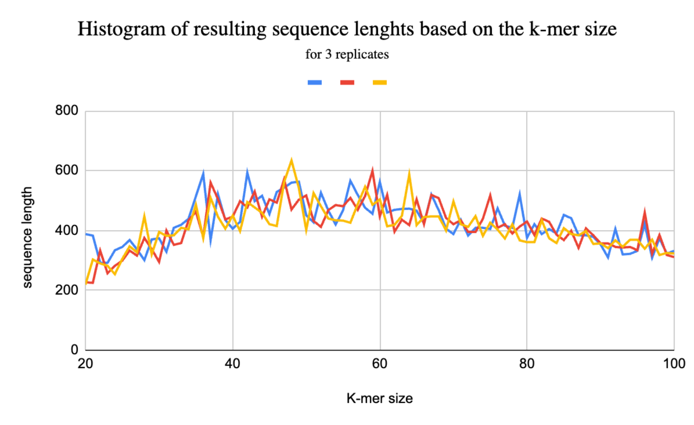

# De_Bruijn_Genome_Assembly
This project aims to assemble a genome form short reads based on the de Bruijn graph method. This project was submitted for the Introduction to Perl course assessment as part of the MSc Bioinformatics for Health Sciences programme at Pompeu Fabra University, Barcelona.

<ins>**Grade obtained: 9.75/10**</ins>

## Introduction
The PERL programme submitted aims to assemble a genome from a set of read sequences provided in FASTQ format. The programme achieves this by utilising the De Bruijn Graph method, which generates a graph of k-mers of a certain size, which overlap to produce an edge. A De Bruijn graph specifically requires that all edges be visited exactly once, or in the case of repeats, the corresponding number of times. This method is hence superior to other genome assembly algorithms as it allows for regions of repeats to be represented in the final result. The necessary input from the user thus comprises a FASTQ file with short reads to be assembled, and a desired k-mer size, the latter of which may have to be adjusted to produce more accurate results.
Due to the nature of a De Bruijn graph, certain requirements must be met, namely that each node, apart from the start and end nodes, must have the same number of outgoing and incoming edges. Due to errors in sequencing, bubbles may occur within the graph. These are characterised by two nodes connected by multiple edges, where one of the nodes has more outgoing than incoming edges, and the other, more incoming than outgoing edges. There are several methods to deal with this scenario, one of those methods, employed in this programme, is to simply find the longest path across a bubble. Another, more sophisticated method would be to determine the optimal path across a bubble by examining the quality of the reads to which the k-mers belong or to look at coverage. These methods could in the future be implemented within the find_longest_path() function. Another hurdle to overcome when constructing a De Bruijn graph is the existence of tails, which are long sequences of nodes that protrude out from the graph. This problem is easily identifiable if more than one node in the graph has outgoing - incoming equal to 1 or vice versa. Although the existence of such nodes has been found when testing the programme, the approach chosen to overcome this was simply to find the longest path across the graph from each start node (i.e., a node where out - in edges = 1).

## Programme Execution
This programme is executable from the command line. As previously mentioned the user must provide a FASTQ file as the first argument and a desired k-mer length as the second argument. The former may be compressed (.gz) or simply a .fq file, other file formats will not be recognised by the programme and execution will be terminated. The k-mer size must be an integer between 0 and 200. No additional arguments may be passed.
```bash
deBruijn_Assembler.pl short_reads.fastq 30
```
First, the programme parses the FASTQ file, i.e., reads it to produce several hashes used later in the programme, these include a hash of hashes to store the connecting nodes (*%seqs*), a hash of edges (*%edges*) and a hash to store the integer value of in - out edges for each node (*%eulerian_nodes*). A hash of hashes has been chosen as the data structure to emulate a graph, due to the potentially large size of the graph.\
The next step is to traverse the graph and find bubbles based on the *%eulerian_nodes* hash. The *skips_hash()* subroutine finds the longest path across a bubble and saves the sequence that it produces into the *%skip_sequences* hash to be used later. Finally the *simplify_graph()* function modifies the initial hash of hashes (*%seqs*) so that the graph fits the prerequisites for an Eulerian traversal. It is then possible to traverse the graph starting from the nodes which have one more outgoing edge than incoming edges. While the conventional methods for graph traversal, such as a depth-first search algorithm rely on recursive execution of a function, here it is computationally impossible due to the stack limitations imposed by PERL and by the hardware limitations of most computers. Hence, an explicit stack had to be defined to overcome the stack overflow issue. As such, a much larger input can be used without the programme dying.

## Results
The final result is a sequence that represents the longest found path across the graph. This sequence is saved to a FASTA file called final_sequence.fasta, in which the header is the name of the initial FASTQ file provided. The programme displays a message as standard output when the task is complete. In order to understand the influence of the k-mer size on the final output the programme has been executed iteratively in the range of 20 to 100, using the sample1.fq and the result is the following histogram.



As we can see the sequence lengths produced are much lower than expected given the input. This is due to the stop condition specified in the *traverse_graph()* subroutine. The edge count for each node visited is decreased by 1 on line 201. This may cut off parts of the graph from being traversed, resulting in a largely reduced output sequence length. A proposed solution for this problem has been included on lines 198 - 200. Here the previously visited edge is incremented and only the final edge remains reduced by 1. This solution however is too computationally complex to execute on most machines and has thus been commented off, leaving the script unchanged. From the histogram we can also deduce the optimal k-mer size to be used for a De Bruin graph genome assembly. Here the optimal range appears to fall between 30 and 60.

## Conclusion
In summary, this programme is an example of a genome assembly algorithm which uses the De Bruijn graph approach. It demonstrates the underlying principles of genome assembly, namely the data structures employed and the individual methods. The limitations of the programme also demonstrate the imperfect nature of genome sequencing and real-world hurdles encountered when attempting such endeavour. Future improvements of this programme may be done, for instance, by including the quality of the reads provided in the FASTQ file, or looking more closely at the coverage. Further attention may be given to improve how the programme deals with tails that diverge from the graph, and the computational methods for traversing a large input file. This programme has been tested on a variety of inputs and works as expected without errors.
